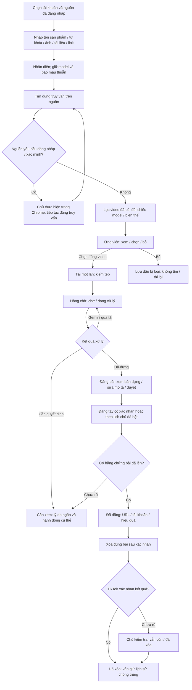

# Luồng nghiệp vụ và giao diện TrendVN — 2026-10-07

Thiết kế trước triển khai theo yêu cầu chủ. Tài liệu này chốt trải nghiệm và thứ tự sửa, bổ sung máy trạng thái kỹ thuật ở SYSTEM-FLOW.md. Không đổi quyền đăng/xóa, tự bật lịch hay lấy lại video đã có.

## 1. Mục tiêu và vấn đề đã đo

Người dùng cần biết: đang ở bước nào, hệ thống có thực sự làm việc không, việc gì cần mình làm tiếp. Một màn hình chỉ trả lời một nhóm câu hỏi. “Đã chạy một lệnh” không đồng nghĩa “video đang ở trạng thái đó”.

Bằng chứng trước sửa:
- Ảnh chủ gửi ở khoảng 787 px: menu xuống hai hàng, bảng bảy cột ép chữ, tab Hàng đợi hiện cả Tổng quan và Đăng bài.
- Chrome thật 1669 px: 6/6 section đều hiện. CSS/JS chỉ bật tab riêng ở <=720 px, trong khi người dùng hiểu đây là tab ở mọi cỡ màn hình.
- Task panel lấy duy nhất tasks[0], nên một việc khác làm biến mất tiến độ liên quan; cùng fragment tiến độ lại được chép vào nhiều tab.
- Lỗi xóa cũ vẫn đỏ dù bài đã chốt deleted. Chuỗi Locator/Call log lọt vào màn hình thường.
- `dirty` bị giữ vĩnh viễn sau tương tác chat, làm cơ chế tải lại trang ngừng cập nhật các danh sách. Hoàn tất việc có bản nháp chỉ đổi task panel, không đổi video/badge.
- Kiểm tra thật lúc bắt đầu: không tác vụ đang chạy; ACE68 c760f78839e34754a71d9419fc8b1f66 đã dựng xong, awaiting_approval (138,5 giây), chưa đăng. Giữ tệp và bước duyệt.

Mục tiêu nghiệm thu: đúng 1 tab hiện ở 320–1669 px; menu không xuống hàng; thẻ video đọc được ở tablet/điện thoại; không lỗi kỹ thuật thô trong luồng thường; trạng thái đổi trong tối đa một chu kỳ poll mà không mất chữ/tệp/tick/video đang xem; việc đã giải quyết không còn báo lỗi hiện tại.

## 2. Business tổng thể

Hoa hồng là nhánh riêng có điều kiện: link sản phẩm → đối chiếu sản phẩm/tài khoản → chủ xác nhận → lưu link. Chỉ có tài khoản nhà sáng tạo chưa đủ chứng minh quyền API, số bán, hoa hồng hoặc quyền gắn giỏ. Không gọi tương tác là doanh số và không tự gắn giỏ khi chưa có cơ chế được kiểm chứng.

## 3. Sáu màn hình, một trách nhiệm

| Màn hình | Câu hỏi cần trả lời | Nội dung chính | Không đưa vào đây |
|---|---|---|---|
| Tổng quan | Hệ thống đang làm gì, tôi làm gì tiếp? | Chế độ thủ công/tự động; số theo bước; việc đang chạy; lối đi tiếp | Lỗi kỹ thuật lịch sử, hàng trăm ứng viên, form tìm kiếm |
| Hàng đợi | Tìm và chuẩn bị video nào? | Tìm kiếm; kết quả; chờ tải/chờ xử lý/đang xử lý; ứng viên thu thập gập lại | Video đã dựng và bảng bài đã đăng |
| Đăng bài | Video nào cần duyệt hoặc đã sẵn sàng? | Bản dựng, tài khoản nhận, mô tả, duyệt, xem thử, đăng | Tìm kiếm và lỗi của việc xóa bài |
| Cần xem | Việc gì đang cần tôi quyết định? | Video bị giữ, khóa bị từ chối, xác minh, kết quả đăng/xóa chưa rõ | Việc đã giải quyết hoặc Gemini quá tải tự phục hồi |
| Đã đăng | Bài nào đã lên hoặc đã xóa? | Đúng URL/tài khoản, hiệu quả, trạng thái xóa và thao tác theo bài | Lỗi cũ đã được chủ chốt |
| Thêm | Cấu hình và chẩn đoán ở đâu? | Tài khoản, nguồn, lịch/cài đặt, thông báo, nhật ký | Thao tác thường ngày lặp lại ở mọi nơi |

Tất cả cỡ màn hình dùng cùng sáu tab. Dưới 960 px dùng thanh dưới dàn đều; từ 960 px dùng thanh trên một hàng. Link #search cũ vẫn mở Hàng đợi. n8n nằm trong Thêm để không chen thành mục thứ bảy.

## 4. Nguồn sự thật và cách hiển thị

| Dữ liệu | Có thẩm quyền quyết định | Hiển thị |
|---|---|---|
| jobs.state | Video đang ở bước nào | Thẻ video, badge, nút hợp lệ |
| tasks.state / steps | Một tác vụ nút bấm đang làm gì | Tiến độ, tên bước, thời gian bắt đầu; không tự đổi video từ task |
| post_deletions.state | Kết quả xóa hiện tại | Đã xóa / cần kiểm tra / chưa xóa; ghi nguồn bằng chứng |
| channel_logins / heartbeat | Phiên hoặc dịch vụ đã kiểm gần nhất | Nêu thời điểm; không suy ra đang tìm hoặc đã đúng tài khoản chỉ từ cookie |
| events / lỗi tác vụ đã kết thúc | Nhật ký quá khứ | Thu gọn ở Thêm; không giả làm lỗi hệ thống hiện tại |

Tiến độ thật chỉ gồm tên bước và thời gian; không tạo % giả. Đang xử lý từ n8n vẫn phải được nhận từ jobs.processing, dù không có task nút bấm. Khóa nút theo đúng tài nguyên đang bận, không khóa cả hệ thống chỉ vì tác vụ độc lập.

Task panel chọn việc phù hợp với màn hình, ưu tiên việc đang chạy. Kết quả xóa đã được chốt làm lỗi xóa cũ hết hiệu lực trong màn hình thường, nhưng vẫn có trong nhật ký. Thông báo sau thao tác chỉ hiện tại nơi thao tác và không tự lặp khi làm mới.

## 5. Thông báo và lỗi

Một thông báo thường có: chuyện gì xảy ra → video/dữ liệu có bị ảnh hưởng không → bước tiếp theo. Không hiện stack trace, selector, payload, tên lỗi Python hay lời nhắc chạy lệnh trong luồng chính.

| Tình huống | Thông báo thường | Nơi / hành động |
|---|---|---|
| Tự đăng tắt theo lựa chọn chủ | “Đang dùng chế độ thủ công” | Tổng quan; trạng thái trung tính, không coi là lỗi |
| Gemini quá tải/hết thời gian | “Gemini đang bận. Video được giữ trong hàng chờ để thử lại.” | Video chờ và tiến độ; không màu đỏ toàn trang |
| Chưa đăng nhập / CAPTCHA | “Nguồn cần bạn đăng nhập/xác minh.” | Nguồn đang tìm; đúng nút đăng nhập/mở cửa sổ |
| Chưa rõ đã đăng/xóa | “Cần kiểm tra bài trên TikTok trước khi thử tiếp.” | Cần xem / đúng dòng bài; không tự lặp thao tác |
| Lỗi khác | “Chưa hoàn tất thao tác. Dữ liệu được giữ; xem chi tiết trong Nhật ký.” | Phạm vi tác vụ, không tràn ra mọi tab |
| Thành công đã quá hạn / đã được xử lý tiếp | Không chiếm chỗ hiện tại | Nhật ký nếu cần tra |

Lớp trình bày dùng cùng một bộ phân loại thông báo. Không đổi lỗi thô trong dữ liệu nhật ký, không che một việc còn cần người quyết định. Thông báo điện thoại hiện có giữ nguyên quy tắc chống spam; lần này không gửi thử bên ngoài.

## 6. Giao diện cụ thể

- Hàng đợi gồm hai chế độ trong cùng tab: **Tìm video** và **Chờ xử lý** (số chờ và đang chạy riêng). Mở #queue ưu tiên hàng chờ khi có việc, còn #search mở tìm kiếm. Không buộc cuộn qua cả lịch sử chat để tới hàng chờ.
- Bảng video dùng thẻ ở dưới 960 px; ở bản rộng giữ bảng có chiều rộng tối thiểu và cột tên video rộng hơn metadata. Trạng thái không bị bẻ từng chữ. Nút hành động cùng nhóm, không chiếm hết hàng.
- Các trạng thái trống chỉ nói điều phù hợp: không còn video chờ nhưng có bản dựng thì mời sang Đăng bài, không bắt thu thập lại.
- Cài đặt/kênh/link/lịch sử là phần phụ có thể mở khi cần. Truy vấn tìm đang dùng và cảnh báo sai model vẫn nằm gần kết quả.
- Nút chính mỗi khối tối đa một; hành động bỏ/xóa thứ cấp; focus/hover nhất quán, vùng nhấn >=44 px, ô checkbox vẽ 24 px.
- Các tiêu đề, mô tả và thông báo đều đi qua component/escape; sửa `&amp;` đang bị escape lần hai trong nút Bắt đầu.

## 7. Cập nhật trực tiếp không phá thao tác

Một yêu cầu cập nhật trạng thái giao diện đang bay tại một thời điểm; dừng khi tab trình duyệt bị ẩn. Khi đang chạy lấy trạng thái mỗi 2,5–5 giây, khi rảnh tối đa mỗi 15 giây. Chỉ dựng vùng của tab đang xem, badge và tiến độ; không tải lại cả trang định kỳ.

Hàng đợi cập nhật riêng vùng chờ, giữ khung nhập/tệp/tick/scroll; chat đọc lại khi trạng thái video đổi. Đăng bài đang sửa mô tả hoặc phát video thì hoãn thay phần đó, hiện chỉ báo có cập nhật; không bỏ chữ hay dừng video. Thêm không thay form cấu hình. Đổi tab lấy ngay trạng thái mới. Không sao chép tiến độ của một tác vụ sang mọi tab.

Chống trùng giữ nguyên cả ở lọc batch và giao dịch chọn/tải, sau bỏ ứng viên, xóa lịch sử, xóa bài. Không thêm migration hay queue phân tán: chưa có số đo chứng minh cần; sửa nguồn trạng thái và render trước.

## 8. Thứ tự thực hiện và kiểm chứng

1. Rà độc lập business và điểm nguồn sự thật, rồi mới sửa mã.
2. Tab riêng mọi độ rộng, breakpoint 960, thẻ bảng, nhóm điều hướng/hành động và lỗi escape.
3. Trình bày thông báo thống nhất; tiến độ theo màn hình/tác vụ, giải quyết lỗi cũ theo trạng thái hiện tại.
4. Cập nhật từng vùng; thử tác vụ hoàn tất trong lúc có draft, video đang phát, đổi tab và hai tác vụ khác phạm vi.
5. Kiểm thử các lỗi thật nêu trên, Chrome 320/360/375/414/768/960/1024/1440 + ảnh thật kiểu 787 px; mở cả hai màu; không chỉ kiểm không tràn mà kiểm đúng một tab, độ rộng cột và vùng đọc.
6. Áp dụng khi không có việc thật đang chạy; doctor, Chrome trên dữ liệu thật, giữ ACE68 đang chờ duyệt, bài đã xóa và công tắc tự đăng. Rà tĩnh/động/độc lập, ghi số và giới hạn trong ROADMAP/CHANGELOG.

Chưa có cơ sở nói “tối ưu nhất” cho mọi tài khoản/nền tảng. Lần này tối ưu việc người dùng phải làm, sự nhất quán trạng thái và lượng giao diện phải đọc; đo số tab hiện, thông báo lỗi lặp, độ rộng, số yêu cầu và bảo toàn thao tác để nghiệm thu.

Rà business độc lập trước sửa mã bổ sung: lấy toàn bộ task đang chạy dù bị đẩy khỏi lịch sử gần nhất; bảo toàn cả media trong chat; Cần xem tính xóa chưa rõ và nguồn còn đòi xác minh theo báo cáo phiên mới nhất; checklist đăng nhập lấy theo tài khoản, không lấy trạng thái dịch vụ; trở lại trang từ nền cập nhật ngay; phản hồi cũ không ghi đè tab mới và không thay DOM đang chứa focus/hộp xác nhận. Độ trễ nghiệm thu là chu kỳ poll cộng thời gian request.
